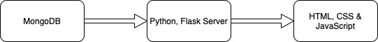
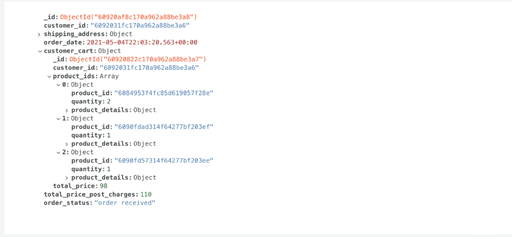
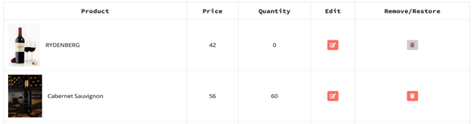

# Beer & Wine Distribution E-Commerce Website

## 1 Project Description

We have created an ecommerce website for selling liquors such as wine
and beer. Our project has a strong user-interface which gives the users
a myriad of options while buying. In the backend, we have implemented
several security measures such as password policy, password hashing and
validating phone numbers and email addresses. We also check uniqueness
of credentials while a new user is signing up. For products, we have
textual search, as well as filtering based on categories and price range
with paging incorporated.

**1.1 Important Components of the System** -

The two main important components of the system are - Admin and Users,
which form the very basic foundation of the website.

**1.2 Admin** - A person who has additional access to features of the
ecommerce portal and able to list all the products in the ecommerce
website, add new products, delete products and update products. Only the
admin can add/change the picture of the product added in the ecommerce
portal.

**1.3 User** - A person who can register himself/herself and then login
into the website anytime. User can view all the available products,
search for specific products, filter products based on the category and
price range. After that, users can add products into the cart and place
the order after providing the shipping address. Users can see their
ordered products history as well.

## 2 Architecture

## 3 Technologies Used

**3.1 Front-End**

1.  HTML, CSS JavaScript

2.  Bootstrap
    [https://icons.getbootstrap.com/](https://icons.getbootstrap.com/)

3.  Jquery [https://jquery.com/](https://jquery.com/)

4.  Font Awesome fonts
    [https://fontawesome.com/](https://fontawesome.com/)

**3.2 Back-End**

1.  Programming Language - Python 3.x

2.  Web-Framework - Flask
    [https://pypi.org/project/Flask/](https://pypi.org/project/Flask/)

3.  MongoDB Interaction - PyMongo
    [https://pypi.org/project/pymongo/](https://pypi.org/project/pymongo/)

4.  Password Hashing - bcrypt
    [https://pypi.org/project/bcrypt/](https://pypi.org/project/bcrypt/)

5.  Password Policy - password-strength
    [https://pypi.org/project/password-strength/](https://pypi.org/project/password-strength/)

6.  WSGI Utilities - Werkzeug
    [https://pypi.org/project/Werkzeug/](https://pypi.org/project/Werkzeug/)

7.  String Validations - Regex
    [https://docs.python.org/3/library/re.html](https://docs.python.org/3/library/re.html)

**3.3 Database**

1.  MongoDB Atlas which provides a shared cluster and allows users to
    create the database on cloud.

## 4 Database Design

For our database, we took a NoSQL approach using MongoDB. Our database
beer\_wine\_website consists of 4 collections, namely -
product\_details, customer\_details, cart and order. A brief description
of all is given below

1.  product\_details - Collection used for storing details of all
    products present in inventory

    a.  \_id (ObjectId) - unique id generated by MongoDB

    b.  name (String) - name of the product

    c.  price (Float) - price of the product

    d.  description (String) - description of the product

    e.  images (Array) - store locations of product images

    f.  category (String) - to store whether product is of type wine or
        beer

    g.  stock (Integer) - number of items present in inventory

    h.  brand (String) - brand name of the product

    i.  deleted (Boolean) - to store flag for soft-deletion

2.  customer\_details - Collection used for storing details of all
    registered users

    a.  \_id (ObjectId) - unique id generated by MongoDB

    b.  user\_name (String) - customer username for logging into account

    c.  full\_name (String) - customer full name for credentials

    d.  email\_id (String) - customer email address

    e.  password (Binary) - hashed password of user

    f.  shipping\_address (Object) - contains address object with
        details like city, state, zip code, etc

    g.  contact\_no (String) - customer contact number

    h.  govt\_id (String) - customer government id number

    i.  isAdmin (Boolean) - flag to store if user has admin rights

3.  cart - Collection used for storing required cart information based
    on a certain customer

    a.  \_id (ObjectId) - unique id generated by MongoDB

    b.  customer\_id (String) - customer id of person to whom this cart
        belongs, this refers to \_id (ObjectId) attribute of
        customer\_details table

    c.  product\_ids (Array) - contains objects with product\_id and
        quantity data

    d.  total\_price (Float) - computed total price of the products in
        the cart

4.  order - Collection used for strong all orders made with respect to a
    certain customer

    a.  \_id (ObjectId) - unique id generated by MongDB

    b.  customer\_id (String) - customer id of person to whom this order
        belongs, this refers to \_id (ObjectId) attribute of
        customer\_details table

    c.  shipping\_address (Object) - shipping address of customer

    d.  order\_date (Date) - store date and time when order was made

    e.  total\_price\_post\_charges (Float) - total price of cart +
        additional costs

    f.  order\_status (String) - store status of the order, like order
        received/shipped /delivered, etc

    g.  customer\_cart (Object) - this is the whole cart object pulled
        from the cart table based on a certain customer\_id

## 5 Main Functionalities

**5.1 User Signup**

Any new user can SignUp or register by providing valid details. All the
input fields are mandatory. The inputs are validated both in the
front-end and back-end and error messages are provided for any invalid
entry. We have also incorporated strong password checks and provide the
error message if the user doesn't provide the password according to the
constraint.

After successful SignUp, we can see that an entry of the new user has
been created in our customer\_details collection. Also, the password is
stored in a hashed form and is not human readable. If the user tries to
register again with the same username or email, our system throws an
error that the user already exists. Also, by default, the isAdmin flag
is set to False.

**5.2 User Sign in**

Any registered user can sign in using valid credentials. For admins,
they can check the "Login as admin" check-box, and if credentials are
successfully validated, the admin view will open instead of the user
view.

**5.3 Updating User Details**

After logging in, an user can provide/update his/her shipping address
details and other contact information. This information is populated
automatically when an user tries to place the order. If not, then the
user has to provide

After clicking on "Update Address", the changes are reflected in
MongoDB.

**5.4 View All Products**

Clicking on the "PRODUCTS" button on the Navigation pane, the user can
view all the products available in the inventory with the price and the
available stock.

**5.5 Searching & Filtering Products/View Products By Category**

The user has the option to filter by category. For example, selecting
the category as wine and clicking on the search button shows all the
wines available in the inventory.

> 

On each page, we provide pagination as well. Users can go to different
pages to see other products.

**5.6 View Products by Price Range**

The user also has the option of adding price ranges for filtering
products. For example, here setting the price range between 60 and 100
will show the products in that range. Paging functionality has also been
incorporated in filtering functionality.

**5.7 Product Search By Name**

In addition to the above filtering methods, an user also has the luxury
of textual search. In such cases, the backend will return all the
products having that string in the product title. For example, here
searching using the phrase "Jacob" displays all the products with that
phrase in their title. Paging functionality has also been incorporated
in Searching functionality as well.

**5.8 Adding Product To Cart**

An user can hover over the item and the cart button will appear.
Clicking on this button will add the product to the users Cart.

To view all the items a user has in their Cart, they can simply click on
the cart button which appears on the upper right-hand corner of the
screen.

Adding a product to the Cart is also reflected on the database.

**5.9 Modify Product Quantity in Cart**

The website also gives the user the functionality of modifying the Cart.
One can easily change the quantity of the product they have added by
clicking on the +/- buttons.

**The database is updated as well once the user changes the values and
clicks the "Update Cart" button.**

**5.10 Delete Item from Cart**

Clicking on the trashcan icon that appears on the left side of each
product removed the item from the users Cart.

Like quantity update, deletion is also reflected on the database.

**5.11 Place an Order & Checkout**

Once satisfied with the Cart items, an user can click on the "Checkout"
button for proceeding with the order.

The user will next have to provide a shipping address (or can stick with
the default address) and has to choose a method of payment.

**5.12 View Ordered Products History**

To view all the orders/order history, an user can navigate to Orders by
clicking "MY ACCOUNT" \> "ORDERS".

To view order summary, the user can click on the "View" button that
appears on the left side of each
order.

After successfully placing an order, a new entry is created in the
orders collection.

Here, we can see that the whole Cart object is taken from the Cart
collection and is added. Once added, the Cart entry is deleted from the
Cart collection as it will no longer be needed and the user will start
from an empty Cart from next time. We also have some new fields like
order\_date, total\_price\_post\_charges and order\_status.

**5.13 Admin View**

By logging as admin, an admin can view all the products in the
inventory. He/She will be access to add/delete/update any product's
image, description, quantity etc.

**5.15 Add/Delete/Update Product Details**

The Admin can change and modify all these fields, which are product
name, price, stock, brand, description, add and delete photos, and
change the category of the product as well. For images, PNG and JPEG
formats are allowed.

The updates are instantly reflected on the website and database.

**5.16 Soft Deletion of Products**

Admin can soft delete a product by clicking on the trashcan icon that
appears on the left side of each product. Once clicked, the button is
greyed out confirming the deletion.

The changes are reflected in the product\_details collection as well.
Here we see that the stock has been changed to 0 and the boolean field
"deleted" has been changed to true.

